# API Cost Adjuster
API 사용 이력 집계하여 비용을 정산하고 Database에 저장 그리고 전산팀과 고객에게 해당 내용을 email로 전달하는 Batch 서비스 구현.

----
## Service Overview
### Requirements
- 고객은 유료 API 사용한다
- 서비스팀은 유료 API 사용 이력을 남긴다
- 유료 API 사용 이력을 파일로 정산팀에 전달한다 (Random creation)
- 정산팀은 1일 단위로 정산을 한다
- 매주 금요일 1주일 치 1일 정산을 집계해서 DB에 저장하고 고객에게 email로 전달

### Functions
- API 호출 이력 파일 생성
- 일 단위 정산 기능
- 주단위 정산 기능
- 전산팀과 사용자에게 비용 이력 전달 기능

### Job
1. API 호출로 사용 이력을 불러온다.

----
## About Spring Batch
Official Document: https://docs.spring.io/spring-batch/reference/index.html

1. JobLauncher가 Job에 JobParameter를 넣어서 실행
2. JobInstance 생성
3. JobExecution 생성/실행
4. StepExecution
   - Step1 실행
   - Step2 실행
   - ...

### JobLauncher
- Job을 실행시키는 도메인
  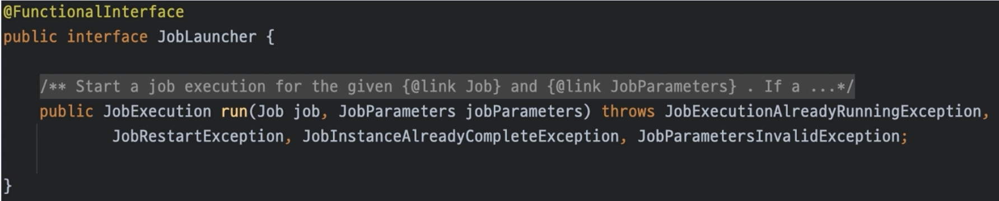

### Job

- 전체 배치 process를 encapsulation한 도메인
- 단순히 Step 인스턴스를 위한 container

### JobInstance
- Job의 논리적 실행단위를 나타내는 도메인
- 하난의 Job이 려러개의 JobInstance를 가짐
- BATCH_JOB_INSTANCE table에 저장
  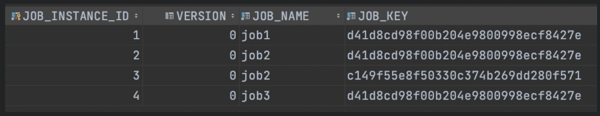

### JobParameter
- Job을 실행할 때 함께 사용되는 parameter 도메인
- 하나의 Job에 존재할 수 있는 여러개의 JobInstance를 구분
- BATCH_JOB_EXECUTION_PARAMS table에 저장
  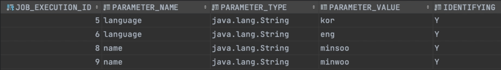

### JobExecution
- Job의 단일 실해에 대한 도메인
- Job 실행 중에 실제로 일어난 일에 대한 기본 저장메커니즘
- BATCH_JOB_EXECUTION table에 저장
  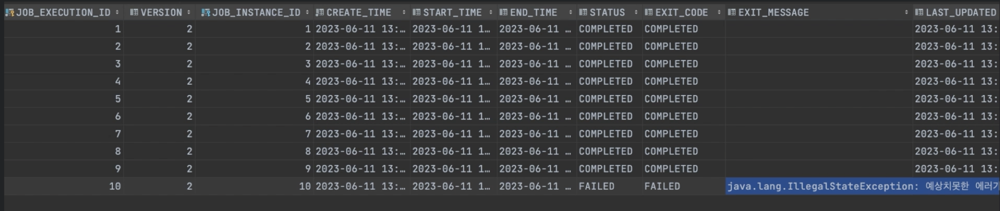

### Step

- 배치 작업의 독립적이고, 순차적인 단계를 encapsulation한 도메인
- 하나의 Job은 한 개 이상의 Step을 가짐
- 입력 자원을 설정하고 어떤 방법으로 어떤 과정을 통해 처리할지 그리고 어떻게 출력 자원을 만들 것인지에 대한 모든 설정
  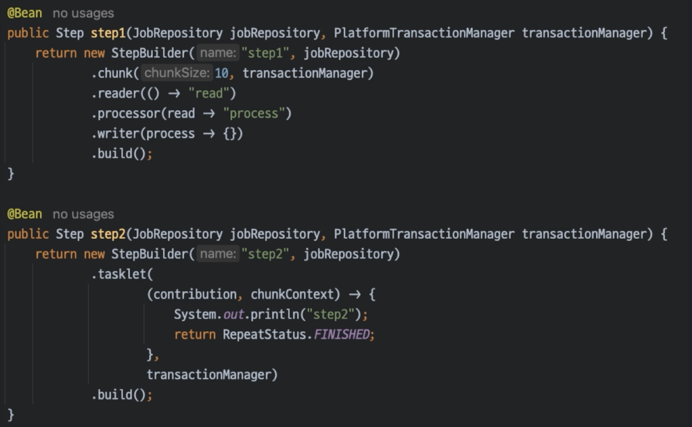
- reader, processor, writer, tasklet, chunk 로 구성되어있다

### StepExecution
- Step의 단일 실행에 대한 도메인
- Step 실행 중에 실제로 일어난 일에 대한 기본 저장 메커니즘
- BATCH_STEP_EXECUTION table에 저장
  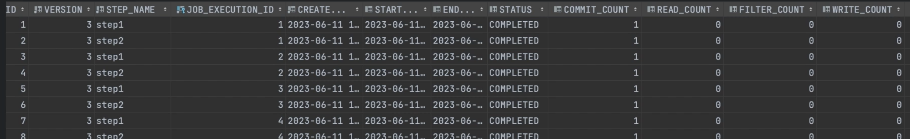

### ExecutionContext
- Batch의 세션 역할을 하는 도메인
- Job, Step의 상태를 가진다
- 단순한 key-value 구조
- BATCH_JOB_EXECUTION_CONTEXT, STEP_JOB_EXECUTION_CONTEXT table에 저장
  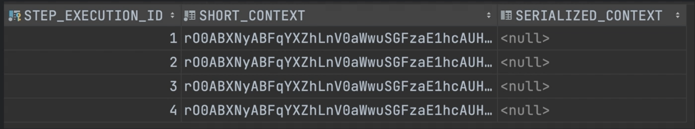

### JobRepository
- Job 저장소 도메인
- 위의 모든 도메인들을 저장
    - JobInstance
    - JobExecution
    - JobParameter
    - StepExecution
    - ExecutionContext(Job, Step)
- 배치의 상태를 DB에 저장한으로서 다양한 기능에 활용할 수 있음
    - 오류복구
    - 재시작 여부
    - 모니터링

### Batch Metadata
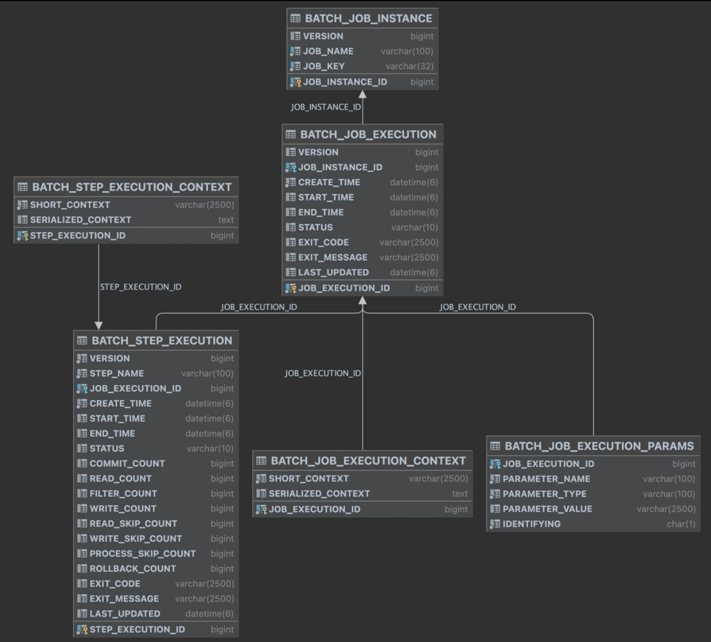

----
### ItemReader/Processor/Writer

### ItemReader
- 배치의 입력 도메인
### ItemProcessor
- 배치의 비지니스를 처리하는 도메인
### ItemWriter
- 배치의 출력 도메인

## About Batch Optimization
### Chunk
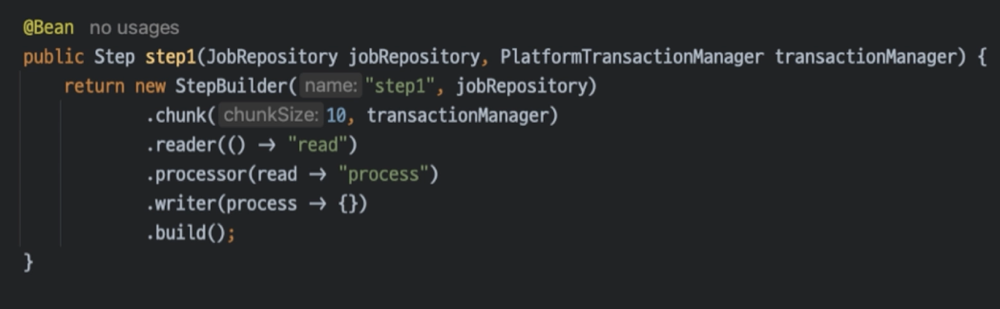

### Multi-threaded step
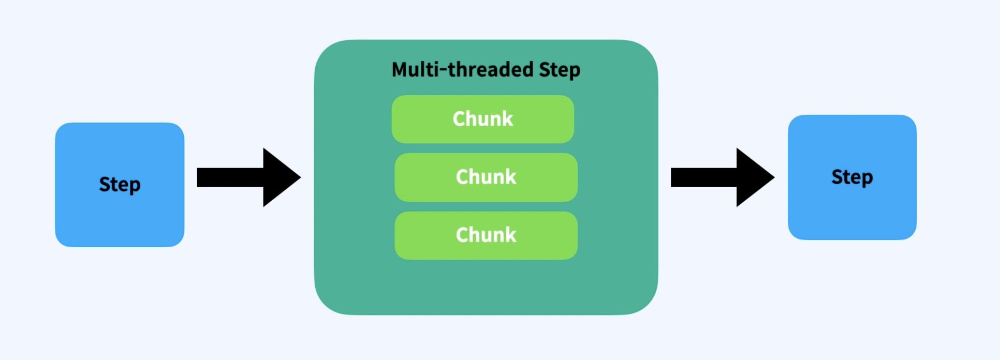
- Chunk 단위를 병렬로 빠르게 실행
- Race Condition이 발생할 수 있음
- Thread Safe 확인 필수
  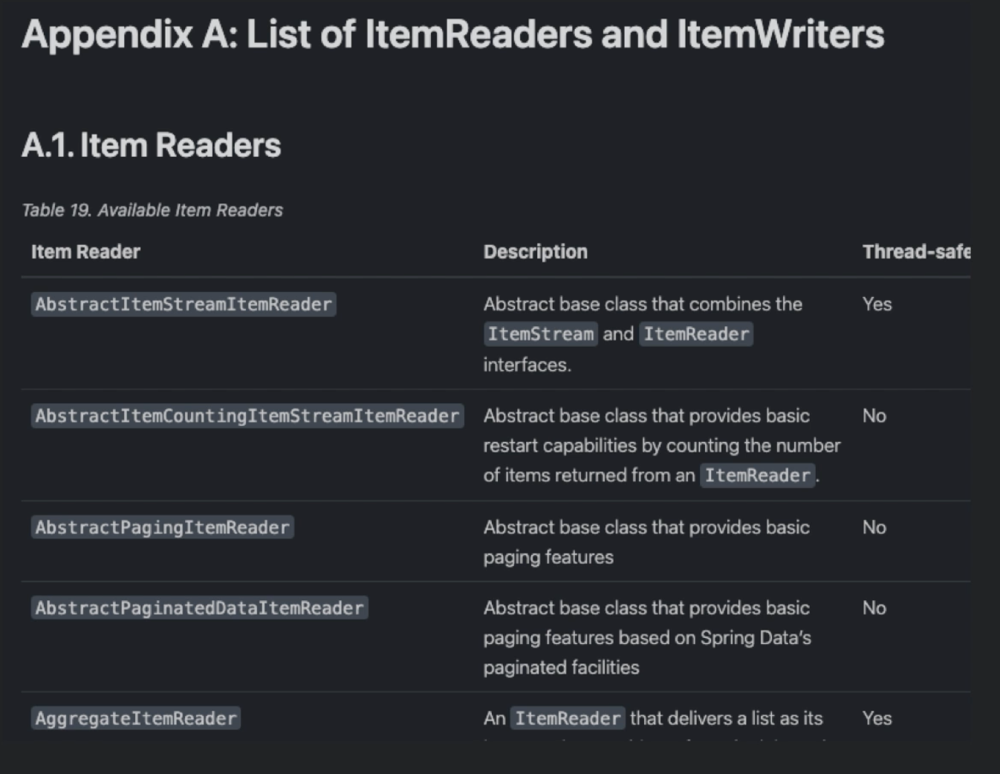
- 샘플
  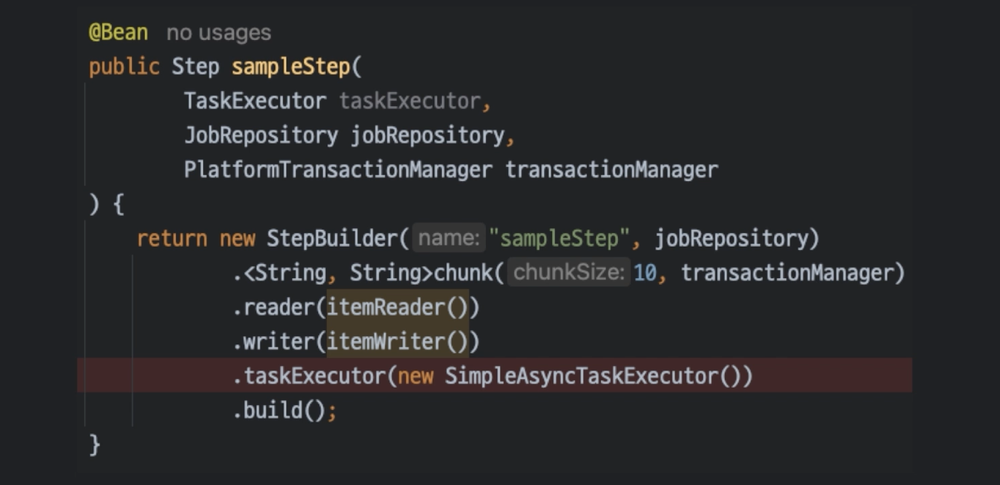

### Parallel step
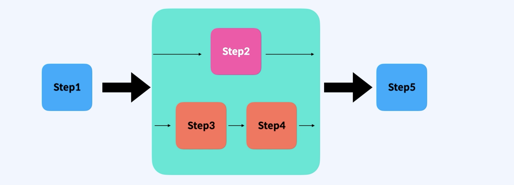
- 순차적이 아닌 Step이 병렬로 처리된다
- 샘플
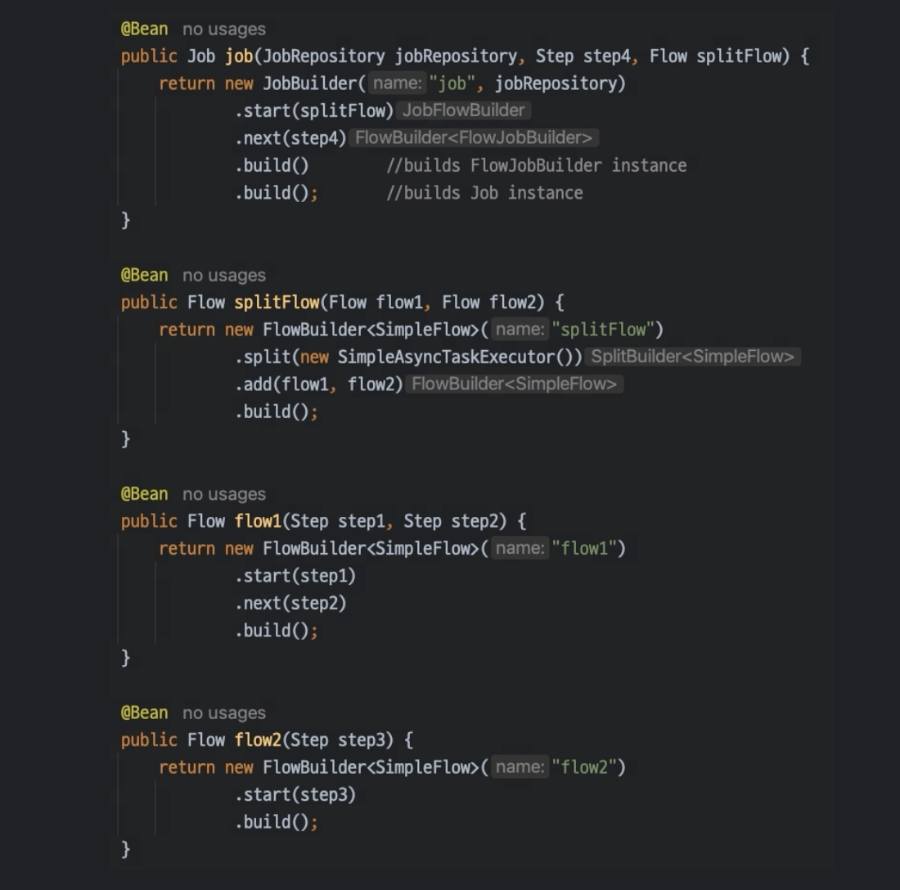

### Partitioning
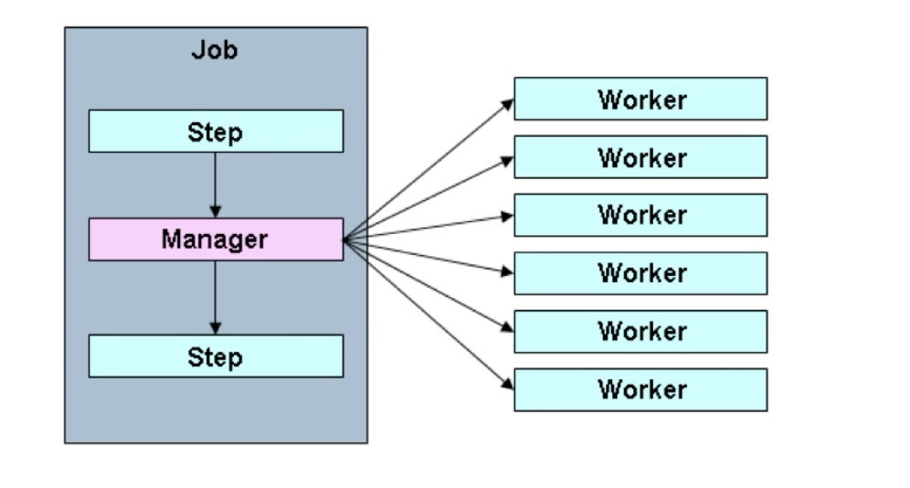
- Worker step으로 나누어서 실행된다
- Multi-thread와 다르다
- 재시작 지원
 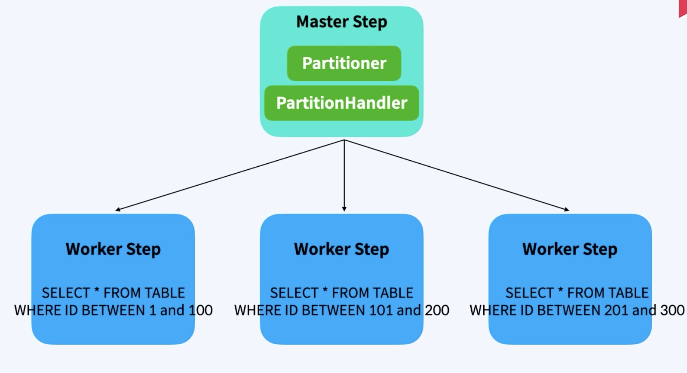
- TaskExecutorPartitionHandler 와 MessageChannelPartitionHandler로 나누어 진다

